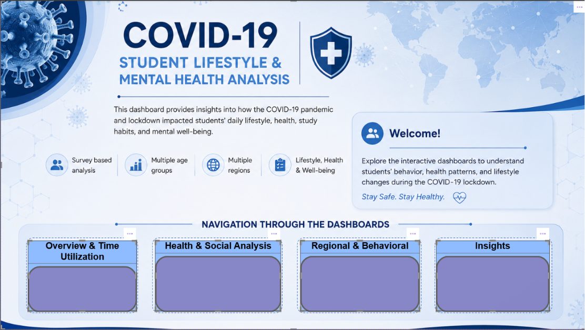
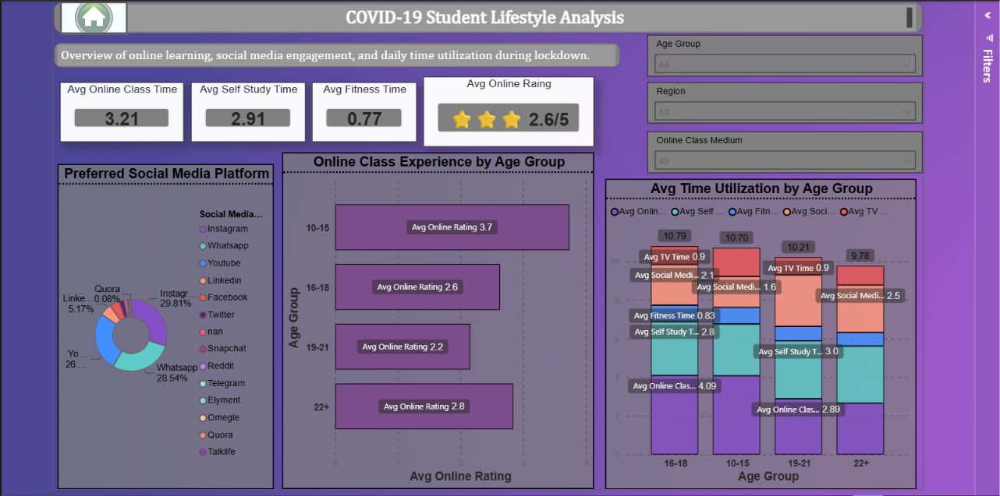
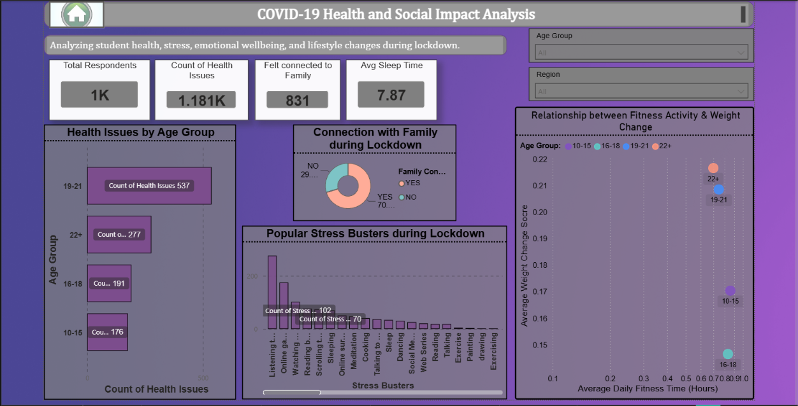
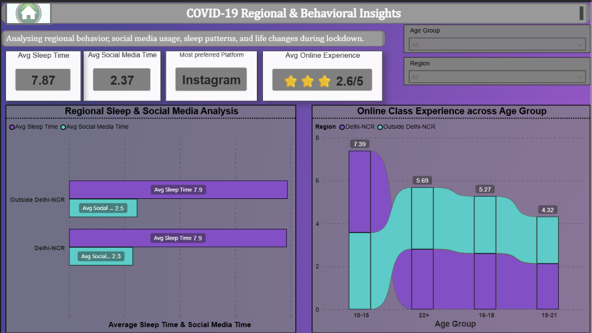
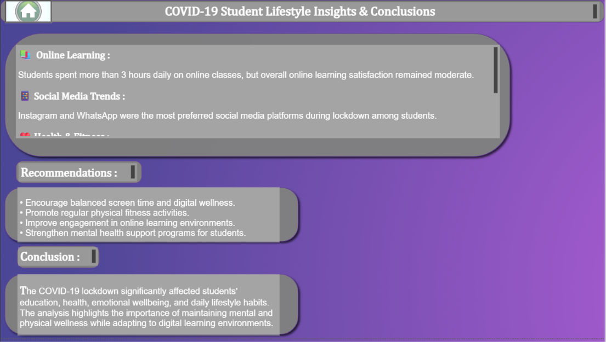

# 🦠 COVID-19 Student Survey Analysis Dashboard using Power BI

An interactive Power BI dashboard developed to analyze the impact of the COVID-19 pandemic on students' education, lifestyle, health, and social behavior using survey data, DAX, Power Query, and business intelligence visualizations.

---

# 👨‍💻 Developed By

**Viraj Waikar**

---

# 📖 Project Overview

This project presents an interactive Power BI dashboard that analyzes student survey responses collected during the COVID-19 pandemic.

The dashboard explores how lockdown affected students' online learning, daily routines, health, fitness, family interaction, social media usage, and overall lifestyle through multiple interactive report pages.

The objective is to transform raw survey responses into meaningful insights that help understand behavioral changes during the pandemic.

---

# 🎯 Business Problem

The COVID-19 pandemic significantly changed students' lifestyles, education patterns, and daily habits.

Educational institutions wanted to understand:

- How students adapted to online learning.
- How their health and lifestyle changed.
- Which activities consumed most of their time.
- How social interactions changed.
- Which regions and age groups were affected differently.

Using Power BI, this dashboard transforms survey responses into actionable business insights for educators, researchers, and decision-makers.

---

# 🎯 Project Objectives

The dashboard aims to:

- Analyze students' daily routine during lockdown.
- Understand online learning behaviour.
- Evaluate physical and mental health indicators.
- Study social media usage.
- Compare regional behavioural differences.
- Identify lifestyle changes caused by COVID-19.
- Provide actionable insights using interactive visualizations.

---

# 📊 Dataset Information

The project uses survey responses collected from students during the COVID-19 pandemic.

### Dataset includes:

| Column | Description |
|---------|-------------|
| Age | Student age |
| Gender | Gender |
| Region | Student location |
| Online Class Time | Hours spent in online classes |
| Self Study Time | Daily self-study hours |
| Fitness Time | Time spent exercising |
| Sleep Time | Sleeping hours |
| Social Media Platform | Preferred platform |
| Health Issues | Health problems during lockdown |
| Meals Per Day | Eating habits |
| Family Connection | Family interaction |
| Stress Busters | Activities reducing stress |
| Online Class Experience | Student experience rating |

---

# 📈 Dashboard Preview



---
# 📑 Dashboard Components

## 🏠 1. Introduction Page


This page introduces the project, explains the dashboard objectives, and provides navigation across the report.

**Purpose:**
- Introduce the COVID-19 Student Survey project.
- Explain dashboard objectives.
- Improve user experience through report navigation.

---

## ⏰ 2. Overview & Time Utilization



This page analyzes how students spent their time during the COVID-19 lockdown.

### Business Questions Answered

- What is the average online class time?
- How much time do students spend on self-study?
- How much time is dedicated to fitness?
- Which social media platform is most preferred?
- How do students rate their online learning experience?

**Business Value**

- Helps educational institutions understand online learning behaviour.
- Identifies time management patterns during lockdown.
- Supports improvement of digital learning strategies.

---

## ❤️ 3. Health & Social Analysis



This page evaluates students' health, eating habits, family interaction, and stress management during the pandemic.

### Business Questions Answered

- What health issues were most common?
- How many meals did students consume daily?
- Did students experience weight changes?
- How connected did students feel with their families?
- Which stress busters were most popular?

**Business Value**

- Helps understand physical and mental well-being.
- Identifies lifestyle changes caused by lockdown.
- Supports student wellness initiatives.

---

## 🌍 4. Regional & Behavioral Insights



This page compares student behaviour across different regions and demographic groups.

### Business Questions Answered

- Which regions were most affected?
- How does behaviour differ by age group?
- Which activities were most missed?
- How did online class ratings vary across regions?
- Which demographic groups showed different behavioural patterns?

**Business Value**

- Enables regional comparison.
- Supports targeted educational policies.
- Identifies demographic trends for future planning.

---

## 💡 5. Insights & Recommendations



This page summarizes the key findings from the analysis and provides business recommendations.

### Recommendations include

- Improve online learning engagement.
- Encourage healthier daily routines.
- Promote physical activity.
- Support students' mental well-being.
- Enhance digital education strategies.
- Encourage better work-life balance for students.

---

# 📌 Key Performance Indicators (KPIs)

The dashboard tracks several important metrics to understand the impact of COVID-19 on students:

- Average Online Class Time
- Average Self Study Time
- Average Fitness Time
- Average Sleep Time
- Online Learning Experience Rating
- Preferred Social Media Platform
- Health Issue Distribution
- Family Connection Level
- Meals Per Day
- Regional Student Distribution

---

# 📊 Business Questions Solved

This dashboard provides answers to the following business questions:

- How did students spend their time during the COVID-19 lockdown?
- What was the average duration of online classes?
- How much time was allocated to self-study and fitness?
- Which social media platforms were most frequently used?
- What health issues were experienced by students?
- How did lockdown affect eating and sleeping habits?
- Which stress-relief activities were most popular?
- How connected did students feel with their families?
- How did student behaviour differ across regions?
- What improvements can educational institutions implement for future online learning?

---

# 💡 Key Business Insights

Key findings from the analysis include:

- Students spent a significant portion of their day attending online classes.
- Self-study habits varied considerably among students.
- Fitness activities decreased for many students during lockdown.
- Social media usage increased as a primary communication platform.
- Sleep patterns and eating habits changed during the pandemic.
- Mental and physical health concerns became more noticeable.
- Family interaction generally increased during lockdown.
- Student experiences differed across regions, highlighting the need for location-specific educational strategies.
- Interactive dashboards enable educators and decision-makers to quickly identify behavioural trends and areas for improvement.

---

# ⚙️ Power BI Features Used

This project demonstrates practical business intelligence development using Microsoft Power BI.

### Features Used

- Power Query
- Data Cleaning
- Data Transformation
- Data Modeling
- Interactive Dashboards
- KPI Cards
- Slicers
- Navigation Buttons
- Bookmarks
- Tooltip Pages
- Drill-through Navigation
- Charts and Visualizations
- Business Intelligence Reporting

---

# 🧮 DAX Measures Used

The dashboard uses DAX (Data Analysis Expressions) to calculate dynamic KPIs and analytical metrics.

Examples include:

- Average Online Class Time
- Average Self Study Time
- Average Fitness Time
- Average Sleep Time
- Student Count
- Experience Rating Metrics
- Dynamic KPI Calculations

> *Additional DAX measures can be viewed in the Power BI (.pbix) project file.*

---

# 💻 Technologies Used

- Microsoft Power BI
- Power Query
- DAX
- Data Modeling
- CSV Dataset
- Business Intelligence
- Interactive Reporting
- Data Visualization

---

# 📂 Project Structure

```text
COVID-19-Student-Survey-Dashboard-PowerBI/
│
├── README.md
├── LICENSE
├── Covid-19_student_survey_Sol.pbix
│
├── dataset/
│   ├── README.md
│   ├── COVID-19 Survey Student Responses.csv
│   └── Details about the Problem.txt
│
└── images/
    ├── README.md
    ├── 01_intro_page.png.png
    ├── 02_overview_time_utilization.png.png
    ├── 03_health_social_analysis.png.png
    ├── 04_regional_behavioral_insights.png.png
    └── 05_insights_conclusion.png.png
```

---

# 🚀 How to Use

1. Download or clone this repository.
2. Open **Covid-19_student_survey_Sol.pbix** using Microsoft Power BI Desktop.
3. Refresh the dataset if required.
4. Navigate through the report using the built-in navigation buttons.
5. Apply filters and slicers to perform interactive analysis.
6. Review the **Insights & Recommendations** page for key findings.

---

# 🎯 Skills Demonstrated

### Technical Skills

- Power BI Dashboard Development
- Data Cleaning
- Data Modeling
- Power Query
- DAX
- KPI Design
- Interactive Dashboard Design
- Business Intelligence
- Data Visualization

### Business Skills

- Survey Data Analysis
- Behavioural Analytics
- Health Data Analysis
- Educational Analytics
- Regional Analysis
- Decision Support
- Insight Generation
- Data Storytelling

---

# 📝 Conclusion

This project demonstrates how Microsoft Power BI can transform raw survey responses into an interactive business intelligence solution.

Using Power Query, DAX, KPI reporting, and interactive visualizations, the dashboard provides meaningful insights into students' educational experiences, health, lifestyle, and behavioural changes during the COVID-19 pandemic.

The project highlights the importance of data-driven decision-making for educators, researchers, and policymakers while showcasing modern dashboard development and analytical storytelling skills.

---

# 📬 Connect With Me

**GitHub**

https://github.com/Viraj088889999
